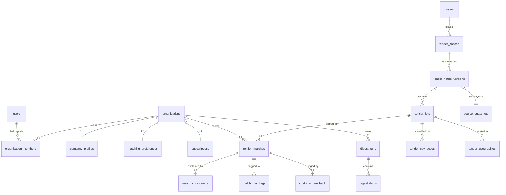

# BidMorrow — Logical Data Model (V1)

Status: design document for the D1 schema (Drizzle ORM). This is the logical
model; the Drizzle schema files in `src/db/schema/` are the source of truth
once implemented, and any divergence must be reconciled back into this doc.

## Conventions

- **Database**: Cloudflare D1 (SQLite). One database, multi-tenant by row
  (`organization_id` column), not by schema.
- **Naming**: `snake_case` for tables and columns. Tables are plural.
- **Primary keys**: `id TEXT` — ULIDs generated in the application (SQLite has
  no native UUID; ULIDs are time-sortable, which makes recent-rows scans on the
  PK cheap).
- **Timestamps**: `INTEGER` epoch **milliseconds**, columns named `*_at`.
  **Every table carries `created_at INTEGER NOT NULL`, and mutable tables also
  `updated_at INTEGER NOT NULL`; both are omitted from the column listings
  below** and only mentioned when their semantics are special.
- **Calendar dates** (no time-of-day semantics): `TEXT` ISO-8601 `YYYY-MM-DD`,
  columns named `*_date` (`publication_date`, `digest_date`). This keeps
  date-equality unique constraints trivial.
- **Booleans**: `INTEGER` 0/1.
- **Enums**: `TEXT` with a `CHECK (col IN (...))` constraint; enum values in
  UPPER_SNAKE where they are domain classifications (e.g. `STRONG_MATCH`),
  lower_snake where they are lifecycle states (e.g. `active`).
- **JSON**: `TEXT` holding a JSON document, columns suffixed `_json`. Used only
  where the payload is opaque to queries (event properties, raw webhook
  payloads, structured reason lists).
- **Money**: `INTEGER` amounts in minor units where exactness matters
  (Stripe), `REAL` for tender estimated values (source data is already
  approximate; EUR-converted values are derived).
- **Tenant ownership**: every table owned by a customer organization carries
  `organization_id TEXT NOT NULL REFERENCES organizations(id)` and an index
  that **leads with `organization_id`**. Such tables are marked
  **[tenant-owned]** below. Tables without the mark are global (tender corpus,
  ops, auth).
- **Foreign keys**: declared in Drizzle and enforced (`PRAGMA foreign_keys` is
  on in D1). Deletes are explicit application-level operations (see
  Retention & archival); no `ON DELETE CASCADE` except where noted, so a bug
  can never silently mass-delete tender or customer data.

## 1. Identity & tenancy

### users — Better Auth core (reconciled Phase 4)

> **Better Auth note:** `users`, `auth_accounts`, `auth_sessions`,
> `auth_verifications`, `auth_rate_limits` are Better Auth 1.6.x CORE tables
> (ADR-0002, ADR-0007 — authentication only, no organization plugin),
> **hand-mapped** in `packages/db/src/schema/identity.ts` to our snake_case
> naming via the `@better-auth/drizzle-adapter` `modelName` + `schema`
> mapping in `packages/auth`. The Better Auth CLI generator does not know
> that mapping, so it cannot produce this file; the hand-authored schema,
> cross-checked against Better Auth's documented core schema and rate-limit
> schema, is authoritative. Migration `0003_auth_tables.sql` created the four
> new tables and added the one missing core column (`image`) to `users`.
>
> **Timestamp/boolean type deviation:** Better Auth's adapter writes native
> JS `Date` objects for every field it documents as type `Date`, and a
> native `boolean` for `email_verified`. These five tables use Drizzle's
> `integer(..., { mode: 'timestamp_ms' })` / `{ mode: 'boolean' }` column
> modes so the JS-side type matches what Better Auth writes; the on-disk
> SQLite storage is still a plain INTEGER (epoch-millis / 0-1), matching the
> rest of the schema's conventions. Only these Better-Auth-owned tables use
> those column modes — every other table keeps the plain-INTEGER convention
> (repositories still write plain numbers via `Date.now()`).

Columns: `id TEXT PK`, `email TEXT NOT NULL` (**unique**),
`email_verified INTEGER NOT NULL` (boolean mode), `name TEXT NULL`,
`image TEXT NULL` (Better Auth core field; unused by V1 — no OAuth/avatar
upload).

- **INTERNAL_ADMIN is not a column and not a membership role.** It is an
  app-level flag resolved from an email allowlist held in configuration
  (environment/secret), checked server-side per request. This keeps the
  Better Auth core schema untouched and keeps admin grants out of
  customer-writable data.

### auth_accounts — Better Auth core (reconciled Phase 4)

Credential/provider accounts per user (V1: email+password only, provider
`credential`). Columns: `id TEXT PK`, `user_id TEXT NOT NULL FK → users`
(indexed), `account_id TEXT NOT NULL` (provider-scoped id — equals `user_id`
for the credential provider), `provider_id TEXT NOT NULL`, `access_token
TEXT NULL`, `refresh_token TEXT NULL`, `access_token_expires_at INTEGER
NULL`, `refresh_token_expires_at INTEGER NULL`, `scope TEXT NULL`, `id_token
TEXT NULL`, `password TEXT NULL` (hash, credential provider only). The
OAuth-only columns are part of Better Auth's documented core `account`
schema and stay nullable — V1 has no OAuth providers.

### auth_sessions — Better Auth core (reconciled Phase 4)

Columns: `id TEXT PK`, `user_id TEXT NOT NULL FK → users` (indexed — revoke-
all on password reset / account deletion), `token TEXT NOT NULL`
(**unique**), `expires_at INTEGER NOT NULL`, `ip_address TEXT NULL`,
`user_agent TEXT NULL`.

### auth_verifications — Better Auth core (reconciled Phase 4)

Email-verification and password-reset tokens. Columns: `id TEXT PK`,
`identifier TEXT NOT NULL` (indexed), `value TEXT NOT NULL`, `expires_at
INTEGER NOT NULL`.

### auth_rate_limits — Better Auth core (reconciled Phase 4)

Database-storage backing for Better Auth's built-in rate limiter (ADR-0002 —
the in-memory default is unusable on Workers). Columns: `id TEXT PK`, `key
TEXT NOT NULL` (**unique**), `count INTEGER NOT NULL`, `last_request INTEGER
NOT NULL` (documented as a plain epoch-ms number, not `Date` — keeps the
repo's plain-INTEGER convention, no `timestamp_ms` mode).

### organizations

The tenant root. Everything customer-owned hangs off this table.

- `id TEXT PK` (ULID) · `name TEXT NOT NULL`.
- `status TEXT NOT NULL` — `active` \| `deleted` (soft-delete gate while the
  purge job hard-deletes owned rows).
- `created_by_user_id TEXT NOT NULL FK → users`.
- No index beyond PK: org lookups are by id (from session → membership).

### organization_members — [tenant-owned]

- `id TEXT PK` · `organization_id TEXT NOT NULL FK → organizations` ·
  `user_id TEXT NOT NULL FK → users`.
- `role TEXT NOT NULL` — `ORGANIZATION_OWNER` \| `MEMBER` (CHECK).
  INTERNAL_ADMIN deliberately absent — see users.
- **Unique** `(organization_id, user_id)` ·
  **Index** `(user_id)` — every authenticated request resolves
  "which org(s) does this user belong to".

## 2. Company profile & preferences

All tables in this section are **[tenant-owned]**. They are small
(tens of rows per org) and read as a whole on every scoring pass, so each
needs only its `organization_id`-leading index/unique. Every table in this
section has `id TEXT PK` and `organization_id TEXT NOT NULL FK →
organizations`; those two columns are not repeated in the compact listings.

### company_profiles

1:1 with organization (`organization_id` **unique**); descriptive profile +
onboarding state.

- `display_name TEXT NULL` · `description TEXT NULL` · `website TEXT NULL`.
- `employee_band TEXT NULL` — e.g. `5-10`, `11-25`, `26-50`.
- `preset_key TEXT NULL` — which preset seeded onboarding
  (`cyber_consultancy`, `cloud_devops`, `software_house`, `it_generalist`).
- `onboarding_completed_at INTEGER NULL` — null until onboarding finished.

### company_capabilities

- `label TEXT NOT NULL` — free text, normalized lower-case for matching.
- **Unique** `(organization_id, label)`.

### company_certifications

Declared certifications, consumed by the eligibility/cert component.

- `certification_code TEXT NOT NULL` — canonical code (`ISO_27001`,
  `ISO_9001`, `SOC2`, `OTHER`).
- `label TEXT NULL` — free-text detail when code = `OTHER`.
- **Unique** `(organization_id, certification_code, label)`.

### company_cpv_preferences

- `cpv_code TEXT NOT NULL` — 8-digit CPV (check digit stripped).
- **Unique** `(organization_id, cpv_code)`.

### company_geographies

Three preference kinds from the matching spec, one row per (kind, code).

- `kind TEXT NOT NULL` — `preferred_nuts` \| `opportunity_country` \|
  `country_served` (CHECK).
- `code TEXT NOT NULL` — NUTS code for `preferred_nuts`, ISO-3166-1 alpha-2
  otherwise.
- **Unique** `(organization_id, kind, code)`.
- Excluded geographies live in `company_exclusions`, not here — exclusion is a
  different behavior (hard exclusion vs. scoring), and mixing them invites
  bugs.

### company_keywords

Positive matching vocabulary. Excluded phrases are **not** kept here — they go
in `company_exclusions` (chosen over a `kind = excluded` variant so that the
hard-exclusion rule set is one table).

- `kind TEXT NOT NULL` — `positive` \| `synonym` (CHECK).
- `term TEXT NOT NULL` — normalized (lower, diacritic-folded) phrase or word.
- `synonym_group TEXT NULL` — group label; required when kind = `synonym`,
  null for `positive` (CHECK).
- `language TEXT NULL` — BCP-47, informs the "matchable language" set.
- **Unique** `(organization_id, kind, term)` ·
  **Index** `(organization_id, synonym_group)` (group-hit counting is
  per-group-once).

### company_exclusions

Inputs to the five hard-exclusion rules.

- `kind TEXT NOT NULL` — `cpv_family` \| `country` \| `nuts` \| `phrase` \|
  `contract_nature` (CHECK).
- `value TEXT NOT NULL` — CPV prefix / ISO country / NUTS prefix / normalized
  phrase / nature code.
- **Unique** `(organization_id, kind, value)`.

### matching_preferences

1:1 with organization (`organization_id` **unique**); scalar knobs the engine
reads.

- `min_value_eur REAL NULL` / `max_value_eur REAL NULL` — null = no bound.
- `supported_contract_natures_json TEXT NOT NULL` — JSON array, e.g.
  `["services","supplies"]`.
- `minimum_days_remaining INTEGER NULL` — null = threshold unset (deadline
  rule scores 0 instead of hard-excluding).

## 3. Buyers

### buyers

Global (not tenant-owned) normalized buyer entities, deduplicated across
notices. Feeds the buyer/sector component and future award-history enrichment.

- `id TEXT PK` · `source TEXT NOT NULL` (`ted`; source-agnostic like notices)
  · `source_buyer_id TEXT NULL` — eForms organization id when present.
- `name TEXT NOT NULL` · `country_code TEXT NULL` (ISO-3166-1 alpha-2).
- `buyer_legal_type TEXT NULL` · `buyer_activity TEXT NULL` — eForms codes.
- **PK** `id` · **Unique (partial)** `(source, source_buyer_id) WHERE
source_buyer_id IS NOT NULL`.
- **Index** `(source, name, country_code)` — dedupe fallback when the source
  provides no stable buyer id.

## 4. Tender corpus (global, grows with notices)

### tender_notices

One row per procurement notice, **source-agnostic** (`ProcurementSource`
interface); the notice is the stable identity across corrections.

| column                | type    | null | notes                                                                                 |
| --------------------- | ------- | ---- | ------------------------------------------------------------------------------------- |
| id                    | TEXT    | no   | PK                                                                                    |
| source                | TEXT    | no   | `ted` in V1                                                                           |
| source_notice_id      | TEXT    | no   | e.g. TED publication number                                                           |
| current_version_id    | TEXT    | yes  | FK → tender_notice_versions; null only during the insert transaction, then always set |
| buyer_id              | TEXT    | yes  | FK → buyers                                                                           |
| notice_type           | TEXT    | no   | eForms notice subtype; V1 ingests COMPETITION types only                              |
| procedure_type        | TEXT    | yes  | open/restricted/negotiated… (notice-level in eForms)                                  |
| eforms_sdk_version    | TEXT    | yes  | null for non-eForms sources                                                           |
| source_languages_json | TEXT    | no   | JSON array of language codes present                                                  |
| source_url            | TEXT    | no   | canonical link to the original notice                                                 |
| publication_date      | TEXT    | no   | `YYYY-MM-DD` of first publication                                                     |
| retrieved_at          | INTEGER | no   | when we fetched it                                                                    |
| content_hash          | TEXT    | no   | hash of current version content (change detection)                                    |
| archived_at           | INTEGER | yes  | set by retention job; archived notices leave the feed                                 |

- **PK** `id` · **Unique** `(source, source_notice_id)` — ingestion
  idempotency: re-fetching a notice upserts, never duplicates.
- **Index** `(publication_date)` — ingestion window queries, admin browsing.
- **Index** `(archived_at)` (partial, `WHERE archived_at IS NOT NULL`) —
  purge job scans.

### tender_notice_versions

One row per **published version/correction**. Rows are immutable — a
correction inserts a new version and repoints
`tender_notices.current_version_id`; history is never overwritten.

| column             | type    | null | notes                                     |
| ------------------ | ------- | ---- | ----------------------------------------- |
| id                 | TEXT    | no   | PK                                        |
| notice_id          | TEXT    | no   | FK → tender_notices                       |
| version_number     | INTEGER | no   | 1..n in publication order                 |
| publication_date   | TEXT    | no   | of this version                           |
| content_hash       | TEXT    | no   |                                           |
| snapshot_id        | TEXT    | no   | FK → source_snapshots (raw payload in R2) |
| eforms_sdk_version | TEXT    | yes  | can change between versions               |
| ingestion_run_id   | TEXT    | yes  | FK → ingestion_runs (provenance)          |

- **PK** `id` · **Unique** `(notice_id, version_number)`.

### tender_lots

Belongs to a notice **version** (a correction can change lots; each version
carries its own lot rows). The matching unit.

| column                   | type    | null | notes                                                                                 |
| ------------------------ | ------- | ---- | ------------------------------------------------------------------------------------- |
| id                       | TEXT    | no   | PK                                                                                    |
| notice_version_id        | TEXT    | no   | FK → tender_notice_versions                                                           |
| lot_number               | TEXT    | no   | `LOT-0001`-style eForms id, or `1` for lotless notices                                |
| title                    | TEXT    | no   |                                                                                       |
| description              | TEXT    | yes  |                                                                                       |
| contract_nature          | TEXT    | yes  | works/supplies/services                                                               |
| estimated_value_amount   | REAL    | yes  | **null = value not published — unknown is explicit, never 0**                         |
| estimated_value_currency | TEXT    | yes  | ISO-4217; null iff amount null                                                        |
| estimated_value_eur      | REAL    | yes  | derived conversion; null when unconvertible → value component UNKNOWN                 |
| value_is_derived         | INTEGER | no   | 1 when procedure total was divided across lots (component scored PARTIAL)             |
| deadline_at              | INTEGER | yes  | submission deadline; **null = no deadline (some procedure types) — explicit unknown** |

- **PK** `id` · **Unique** `(notice_version_id, lot_number)`.
- **Index** `(deadline_at)` — feed expiry filtering (expired lots drop out by
  query, not re-scoring) and the retention job's `deadline + N days` scan.
- NUTS lives in `tender_geographies`, CPV in `tender_cpv_codes` — both are
  multi-valued.

### tender_cpv_codes

- `id TEXT PK` · `lot_id TEXT NOT NULL FK → tender_lots`.
- `cpv_code TEXT NOT NULL` — 8 digits, check digit stripped.
- `is_main INTEGER NOT NULL` — 1 for the lot's main CPV (additional CPVs
  scored at 85%).
- **Unique** `(lot_id, cpv_code)` · **Index** `(cpv_code)` — admin scope
  analysis ("how many notices per CPV division"), future targeted rescoring.

### tender_geographies

- `id TEXT PK` · `lot_id TEXT NOT NULL FK → tender_lots`.
- `country_code TEXT NOT NULL` — ISO-3166-1 alpha-2 (derivable from NUTS
  prefix; stored for query simplicity).
- `nuts_code TEXT NULL` — null when the source gives only a country.
- **Index** `(lot_id)`. No unique constraint: NULL `nuts_code` makes SQLite
  unique semantics unhelpful; ingestion dedupes in-app.

### exchange_rates

ECB euro foreign exchange reference rates used for value-fit scoring only
(ADR-0004). Global; refreshed by the ingestion cron; ~30 currencies per rate
date. A rate is valid for scoring if ≤ 7 days old. _(reconciled Phase 3:
table was specified in ADR-0004 but missing from this doc; added here.)_

- `id TEXT PK` · `rate_date TEXT NOT NULL` — `YYYY-MM-DD` ECB reference date
  the rate was published for.
- `currency TEXT NOT NULL` — ISO-4217 code (e.g. `SEK`).
- `rate_to_eur REAL NOT NULL` — multiplier converting one unit of `currency`
  into EUR (`eur = amount × rate_to_eur`; the inverse of the ECB-published
  currency-per-EUR quote).
- `fetched_at INTEGER NOT NULL` — when the rate was fetched from the ECB
  feed; a re-fetch upserts the same `(rate_date, currency)` row (`updated_at`
  tracks it).
- **Unique** `(rate_date, currency)` — refresh idempotency: the daily fetch
  upserts, never duplicates.

## 5. Ingestion pipeline (global, ops)

### ingestion_runs

One row per scheduled/triggered ingestion execution; the admin debugging
anchor.

- `id TEXT PK` · `source TEXT NOT NULL` · `status TEXT NOT NULL` —
  `running` \| `succeeded` \| `partial` \| `failed` (CHECK).
- `window_from TEXT NOT NULL` / `window_to TEXT NOT NULL` — `YYYY-MM-DD`
  publication window processed.
- Counters, all `INTEGER NOT NULL` default 0: `notices_seen`,
  `notices_upserted`, `versions_created`, `lots_created`, `matches_scored`
  (scoring runs inside the ingestion pipeline), `errors_count`.
- `started_at INTEGER NOT NULL` · `finished_at INTEGER NULL` (null while
  running).
- **Index** `(source, started_at)` — "recent runs" admin view.

### ingestion_checkpoints

Per-source incremental cursor: the last fully processed publication
window/sequence. Exactly one row per source.

- `id TEXT PK` · `source TEXT NOT NULL` — **unique**, singleton per source.
- `last_publication_date TEXT NOT NULL` — `YYYY-MM-DD` last fully-processed
  window.
- `last_sequence_token TEXT NULL` — source-specific pagination/sequence token
  within the window.

### ingestion_errors

Row-level failures that did not abort the run (a bad notice must never stop
the batch).

- `id TEXT PK` · `ingestion_run_id TEXT NOT NULL FK → ingestion_runs`.
- `source TEXT NOT NULL` · `source_notice_id TEXT NULL` — null for
  window-level errors.
- `stage TEXT NOT NULL` — `fetch` \| `parse` \| `map` \| `persist` \| `score`
  (CHECK).
- `error_code TEXT NOT NULL` — stable machine code (e.g. `MISSING_CPV`) ·
  `message TEXT NOT NULL` · `detail_json TEXT NULL` — offending fragment.
- **Index** `(ingestion_run_id)` · **Index** `(source, source_notice_id)` —
  "why is this notice missing?" admin lookups.

### source_snapshots

Pointer to the raw source payload archived in **R2** (the DB stores metadata
only; XML bodies never enter D1).

- `id TEXT PK` · `source TEXT NOT NULL` · `source_notice_id TEXT NOT NULL` ·
  `version_number INTEGER NOT NULL`.
- `r2_key TEXT NOT NULL` — deterministic path:
  `{source}/{yyyy}/{mm}/{source_notice_id}/v{version_number}.xml`.
- `content_hash TEXT NOT NULL` (integrity + change detection) ·
  `size_bytes INTEGER NOT NULL` · `content_type TEXT NOT NULL`.
- `retained_until_at INTEGER NULL` — retention hint for the R2 lifecycle job.
- `deleted_at INTEGER NULL` — tombstone after R2 object deletion (row kept
  for audit).
- **Unique** `(r2_key)` · **Index** `(source, source_notice_id)`.

## 6. Matching results

### tender_matches — [tenant-owned]

One row per (organization, lot, engine version) — the engine-versioned score.
Recomputation inserts new-version rows; it never mutates old ones.

| column             | type    | null | notes                                                                                                                                                   |
| ------------------ | ------- | ---- | ------------------------------------------------------------------------------------------------------------------------------------------------------- |
| id                 | TEXT    | no   | PK                                                                                                                                                      |
| organization_id    | TEXT    | no   | FK → organizations                                                                                                                                      |
| lot_id             | TEXT    | no   | FK → tender_lots                                                                                                                                        |
| notice_id          | TEXT    | no   | FK → tender_notices (denormalized — feed and detail queries group by notice without an extra join through versions)                                     |
| engine_version     | TEXT    | no   | e.g. `1`                                                                                                                                                |
| score              | REAL    | yes  | 0–100; **null when classification = EXCLUDED** (no score shown). REAL because UNKNOWN policy yields half-points (7.5)                                   |
| classification     | TEXT    | no   | `STRONG_MATCH` \| `WORTH_REVIEWING` \| `POSSIBLE_MATCH` \| `LOW_FIT` \| `EXCLUDED` (CHECK)                                                              |
| exclusion_rule     | TEXT    | yes  | which hard rule fired (`excluded_geography`, `excluded_cpv`, `excluded_phrase`, `unsupported_nature`, `deadline_below_threshold`); null unless EXCLUDED |
| exclusion_evidence | TEXT    | yes  | code/phrase/date that triggered the rule                                                                                                                |
| scored_at          | INTEGER | no   | deadline-runway is time-dependent; this anchors reproducibility                                                                                         |

- **PK** `id` · **Unique** `(organization_id, lot_id, engine_version)` —
  contractual; makes re-scoring idempotent per engine version.
- **Index** `(organization_id, engine_version, classification, scored_at)` —
  the feed query (org + latest engine version + classification tab, newest
  first).
- **Index** `(lot_id)` — retention purge walks matches from expiring lots;
  admin match-trace for a lot.

### match_components

Per-match score decomposition (components sum to the total — engine
invariant 2). ~8 rows per scored match.

| column        | type | null | notes                                                                                                                   |
| ------------- | ---- | ---- | ----------------------------------------------------------------------------------------------------------------------- |
| id            | TEXT | no   | PK                                                                                                                      |
| match_id      | TEXT | no   | FK → tender_matches                                                                                                     |
| component_key | TEXT | no   | `cpv` \| `capability` \| `geography` \| `value` \| `buyer` \| `procedure_nature` \| `deadline` \| `eligibility` (CHECK) |
| points        | REAL | no   | awarded (7.5-style halves possible)                                                                                     |
| max_points    | REAL | no   | component max at this engine version                                                                                    |
| status        | TEXT | no   | `MATCHED` \| `PARTIAL` \| `NO_MATCH` \| `UNKNOWN` (CHECK)                                                               |
| explanation   | TEXT | no   | human-readable line, e.g. "value not published — neutral score applied"                                                 |

- **Unique** `(match_id, component_key)` — doubles as the `match_id` lookup
  index (tender detail explanation, digest rendering).
- Not tenant-marked: tenancy is inherited through `match_id`; access always
  goes through the parent match, which is org-checked.

### match_risk_flags

0..n per match; conservative, evidence-backed only (never fabricate a
requirement).

- `id TEXT PK` · `match_id TEXT NOT NULL FK → tender_matches` (**indexed**).
- `type TEXT NOT NULL` — `certification` \| `security_clearance` \|
  `insurance` \| `financial_turnover` \| `prior_experience` \|
  `framework_membership` \| `local_presence` \| `mandatory_references`
  (CHECK).
- `evidence TEXT NOT NULL` — quoted source snippet · `source_field TEXT NOT
NULL` — field path in the source notice the snippet came from.
- `confidence TEXT NOT NULL` — `HIGH` \| `POSSIBLE` (CHECK).
- `explanation TEXT NOT NULL` — rendered wording ("Possible requirement
  detected — verify in source documents.").

## 7. Customer actions & feedback — all [tenant-owned]

### saved_tenders

Lot-level (aligned with matches; the feed row is a lot). Saving **pins** the
underlying tender data against retention purge.

- `id TEXT PK` · `organization_id TEXT NOT NULL FK → organizations`.
- `lot_id TEXT NOT NULL FK → tender_lots` · `notice_id TEXT NOT NULL FK →
tender_notices` (denormalized, same rationale as matches).
- `saved_by_user_id TEXT NOT NULL FK → users`.
- **Unique** `(organization_id, lot_id)` — doubles as the Saved-tab index ·
  **Index** `(lot_id)` — purge job checks "is this lot pinned?".

### ignored_tenders

Identical columns, keys, and indexes to `saved_tenders` (with
`ignored_by_user_id` in place of `saved_by_user_id`) plus optional
`reason TEXT NULL`. Ignoring removes the lot from all feed tabs and does
**not** pin against purge.

### customer_feedback

Useful / Not-useful verdicts with structured reasons. Stored verbatim; never
feeds back into scoring automatically. Pins the referenced match (and its lot)
against purge so feedback stays interpretable.

- `id TEXT PK` · `organization_id TEXT NOT NULL FK → organizations` ·
  `match_id TEXT NOT NULL FK → tender_matches` · `user_id TEXT NOT NULL FK →
users`.
- `verdict TEXT NOT NULL` — `useful` \| `not_useful` (CHECK).
- `reasons_json TEXT NULL` — JSON array of structured reason codes
  (`wrong_cpv`, `wrong_geography`, `too_large`, `too_small`, `not_our_work`,
  `deadline_too_close`, `other`) · `comment TEXT NULL`.
- **Unique** `(organization_id, match_id)` — one live verdict per match;
  changing your mind upserts (updated_at tracks it).
- **Index** `(organization_id, created_at)` — per-org Useful/Not-useful trend
  (pilot success signal).

## 8. Digest & email — [tenant-owned] except deliveries' user-level rows

### digest_preferences

1:1 with organization (`organization_id` **unique**, FK → organizations).

- `enabled INTEGER NOT NULL` default 1 · `send_empty INTEGER NOT NULL`
  default 0 — only send when meaningful matches exist unless opted in.
- `min_classification TEXT NOT NULL` — lowest classification included,
  default `WORTH_REVIEWING`.
- `timezone TEXT NOT NULL` — IANA tz, drives which "day" a digest_date covers.

### digest_runs

One attempted digest per org per day. **The unique constraint is the dedupe
mechanism** — the digest worker inserts first (`INSERT ... ON CONFLICT DO
NOTHING`); losing the insert means another invocation owns today's digest.

- `id TEXT PK` · `organization_id TEXT NOT NULL FK → organizations`.
- `digest_date TEXT NOT NULL` — `YYYY-MM-DD` in the org's timezone.
- `status TEXT NOT NULL` — `pending` \| `sent` \| `skipped_empty` \|
  `skipped_paused` \| `failed` (CHECK).
- `matches_count INTEGER NOT NULL` · `email_delivery_id TEXT NULL FK →
email_deliveries` (null when skipped) · `sent_at INTEGER NULL`.
- **Unique** `(organization_id, digest_date)` — DB-enforced "one digest per
  org per day".

### digest_items

What a digest actually contained, with display snapshots so the row stays
meaningful after the underlying match is purged by retention.

- `id TEXT PK` · `digest_run_id TEXT NOT NULL FK → digest_runs`.
- `match_id TEXT NULL FK → tender_matches` — **SET NULL on purge** of
  unpinned matches.
- `rank INTEGER NOT NULL` — display order.
- `title_snapshot TEXT NOT NULL` · `score_snapshot REAL NULL` ·
  `classification_snapshot TEXT NOT NULL` — captured at send time.
- **Unique** `(digest_run_id, match_id)` · **Index** `(digest_run_id)` ·
  **Index** `(match_id)` (purge SET NULL pass).
- Tenancy inherited through `digest_run_id` (like `match_components` through
  `match_id`); access always goes via the org-checked parent row.

### email_deliveries

Every outbound email (digest, verification, password reset, billing notices).
Org-level for digests, user-level for auth mail — hence both FKs nullable,
CHECK at least one set.

- `id TEXT PK` · `organization_id TEXT NULL FK → organizations` ·
  `user_id TEXT NULL FK → users`.
- `kind TEXT NOT NULL` — `digest` \| `verification` \| `password_reset` \|
  `billing` (CHECK).
- `to_email TEXT NOT NULL` · `provider TEXT NOT NULL` (e.g. `resend`) ·
  `provider_message_id TEXT NULL` — for delivery-event correlation.
- `status TEXT NOT NULL` — `queued` \| `sent` \| `delivered` \| `bounced` \|
  `complained` \| `failed` (CHECK) · `error TEXT NULL`. `updated_at` moves on
  provider status events.
- **Index** `(organization_id, created_at)` — admin "emails for
  this org" · **Unique (partial)** `(provider, provider_message_id) WHERE
provider_message_id IS NOT NULL` — webhook status updates resolve one row.

## 9. Billing — [tenant-owned]

### subscriptions

1:1 with organization (V1: exactly one subscription per org, created at
checkout). Server-side entitlements read this row.

- `id TEXT PK` · `organization_id TEXT NOT NULL FK → organizations` —
  **unique** (1:1).
- `stripe_customer_id TEXT NOT NULL` — **unique**.
- `stripe_subscription_id TEXT NULL` — **unique**; null between customer
  creation and checkout completion.
- `status TEXT NOT NULL` — `trialing` \| `active` \| `past_due` \|
  `canceled` \| `unpaid` (CHECK) — mirrors Stripe.
- `plan TEXT NOT NULL` — `founding` \| `standard` (CHECK).
- `current_period_end_at INTEGER NULL` — entitlement grace boundary.
- `cancel_at_period_end INTEGER NOT NULL` — default 0.
- **Unique** `(organization_id)`, `(stripe_customer_id)`,
  `(stripe_subscription_id)` — the two Stripe uniques are the webhook →
  organization resolution path.

### billing_events

Raw Stripe webhook ledger. **Unique `stripe_event_id` is the DB-enforced
idempotency guard**: handlers insert first; a conflict means the event was
already processed (or is in flight) and the webhook returns 200 without
side effects.

- `id TEXT PK` · `stripe_event_id TEXT NOT NULL` — **unique**.
- `type TEXT NOT NULL` — e.g. `customer.subscription.updated`.
- `organization_id TEXT NULL FK → organizations` — resolved via customer id,
  null when unresolvable.
- `payload_json TEXT NOT NULL` — full event payload.
- `status TEXT NOT NULL` — `received` \| `processed` \| `failed` \| `ignored`
  (CHECK) · `processed_at INTEGER NULL`.
- **Unique** `(stripe_event_id)` · **Index** `(organization_id, created_at)`
  — admin billing debugging.

## 10. Ops, analytics & admin

### product_events

Minimal first-party analytics (no third-party tooling). Append-only.

- `id TEXT PK` · `organization_id TEXT NULL FK → organizations` (null for
  anonymous/marketing events) · `user_id TEXT NULL FK → users`.
- `name TEXT NOT NULL` — e.g. `feed_viewed`, `digest_opened`,
  `match_expanded` · `properties_json TEXT NULL`.
- **Index** `(name, created_at)` — metric counts over time ·
  **Index** `(organization_id, created_at)` — per-org activity (pilot success
  signals).

### audit_events

Append-only audit log for security-relevant and admin actions.

- `id TEXT PK` · `actor_type TEXT NOT NULL` — `user` \| `admin` \| `system`
  (CHECK) · `actor_id TEXT NULL` — users.id for user/admin, null for system.
- `organization_id TEXT NULL FK → organizations` — the org affected, when
  applicable.
- `action TEXT NOT NULL` — stable verb, e.g. `feature_flag.updated`,
  `recompute.triggered`, `org.deleted`.
- `target_type TEXT NOT NULL` (e.g. `feature_flag`, `organization`,
  `subscription`) · `target_id TEXT NULL`.
- `before_summary TEXT NULL` / `after_summary TEXT NULL` — compact
  human-readable before/after state.
- `occurred_at INTEGER NOT NULL`.
- **Index** `(organization_id, occurred_at)` ·
  **Index** `(target_type, target_id)` — "who changed this flag?".

### support_notes — [tenant-owned]

Internal admin notes about a customer org (visible to INTERNAL_ADMIN only —
enforced in the app layer, never rendered to customers).

- `id TEXT PK` · `organization_id TEXT NOT NULL FK → organizations`.
- `author_user_id TEXT NOT NULL FK → users` (must pass admin allowlist
  check) · `body TEXT NOT NULL`.
- **Index** `(organization_id, created_at)`.

### feature_flags

Admin-editable runtime configuration. Values are JSON so one table serves
booleans, numbers and structured config.

- `id TEXT PK` · `key TEXT NOT NULL` — **unique**: `founding_plan_open`,
  `founding_cap`, `ingestion_paused`, `digest_paused`, `ingestion_cpv_scope`.
- `value_json TEXT NOT NULL` — e.g. `true`, `20`,
  `{"divisions":["72","79"],"extra_codes":[...]}`.
- `description TEXT NOT NULL` — what the flag does and safe values.
- `updated_by_user_id TEXT NULL FK → users`. Every flag change writes an
  `audit_events` row.

## 11. Retention & archival

Policy: tender data is kept **until `deadline_at + N days`** (`N` default 60;
lots without a deadline use `publication_date + M days`, `M` default 180).
Two phases, both bounded batch jobs:

1. **Archive** — set `tender_notices.archived_at`; archived notices drop out
   of the feed and admin default views. No rows deleted.
2. **Purge** (archived_at older than the purge lag) — delete, in FK-safe
   order, **unless pinned** (lot referenced by `saved_tenders`, or match
   referenced by `customer_feedback`):
   - `match_risk_flags`, `match_components`, `tender_matches` (by `lot_id`)
   - `digest_items.match_id` → SET NULL (snapshots preserve display)
   - `ignored_tenders` (by `lot_id`)
   - `tender_cpv_codes`, `tender_geographies`, `tender_lots`
   - `tender_notice_versions`, `tender_notices`
   - `source_snapshots`: delete the R2 object, set `deleted_at` (row kept as
     tombstone)

Never deleted by the purge: all company-profile tables, `buyers`,
`digest_runs`/`digest_items` (items only get `match_id` nulled),
`email_deliveries`, billing, events, audit.

## 12. Entity-relationship overview (core tables)

(`tender_notices.current_version_id` back-pointer and denormalized
`tender_matches.notice_id` omitted for readability.)

## 13. Query patterns → indexes

| #   | Query (hot path)                                                                | Table                                              | Index / constraint used                                                      |
| --- | ------------------------------------------------------------------------------- | -------------------------------------------------- | ---------------------------------------------------------------------------- |
| 1   | Resolve session user's org(s) on every request                                  | organization_members                               | `(user_id)`                                                                  |
| 2   | Feed: org + latest engine version + classification tab, newest first, paginated | tender_matches                                     | `(organization_id, engine_version, classification, scored_at)`               |
| 3   | Feed expiry filter: hide lots past deadline                                     | tender_lots                                        | `(deadline_at)`                                                              |
| 4   | Tender detail: components + risk flags for a match                              | match_components / match_risk_flags                | `(match_id, component_key)` unique / `(match_id)`                            |
| 5   | Saved / Ignored tabs; "is lot saved/ignored?"                                   | saved_tenders / ignored_tenders                    | `(organization_id, lot_id)` unique                                           |
| 6   | Ingestion upsert: does this notice exist? changed?                              | tender_notices                                     | `(source, source_notice_id)` unique + `content_hash` compare                 |
| 7   | Ingestion resume point                                                          | ingestion_checkpoints                              | `(source)` unique                                                            |
| 8   | Version insert idempotency                                                      | tender_notice_versions                             | `(notice_id, version_number)` unique                                         |
| 9   | Scoring idempotency / recompute                                                 | tender_matches                                     | `(organization_id, lot_id, engine_version)` unique                           |
| 10  | Digest dedupe (one per org per day)                                             | digest_runs                                        | `(organization_id, digest_date)` unique                                      |
| 11  | Stripe webhook idempotency                                                      | billing_events                                     | `(stripe_event_id)` unique                                                   |
| 12  | Stripe webhook → org resolution                                                 | subscriptions                                      | `(stripe_customer_id)` / `(stripe_subscription_id)` unique                   |
| 13  | Email provider status webhook → row                                             | email_deliveries                                   | partial unique `(provider, provider_message_id)`                             |
| 14  | Purge scan: expired lots, then owned rows                                       | tender_lots / tender_matches / saved_tenders       | `(deadline_at)` / `(lot_id)` / `(lot_id)`                                    |
| 15  | Admin: notices per window, run history, notice errors                           | tender_notices / ingestion_runs / ingestion_errors | `(publication_date)` / `(source, started_at)` / `(source, source_notice_id)` |
| 16  | Admin: CPV scope analysis                                                       | tender_cpv_codes                                   | `(cpv_code)`                                                                 |
| 17  | Feedback trend per org                                                          | customer_feedback                                  | `(organization_id, created_at)`                                              |
| 18  | FX rate lookup for scoring; daily refresh upsert                                | exchange_rates                                     | `(rate_date, currency)` unique                                               |

Indexes not listed here should not exist — every index costs write throughput
on the ingestion hot path and D1 storage.

## 14. Growth profile & size projection

Assumptions: scoped ingestion **150–300 notices/day** (mid 225), ~1.6
lots/notice (~360 lots/day), ~2.5 CPV rows and ~1.3 geography rows per lot,
**30 active customer orgs**, retention keeps a live window of roughly **150
days** of tender data (deadline + 90d per ADR-0003, staggered deadlines) —
sizes below scale accordingly (~25% above a 120-day window; conclusions
unchanged).

| Table                                            | Grows with                       | Rows/day (mid)   | ~Bytes/row                         | Steady-state size                 |
| ------------------------------------------------ | -------------------------------- | ---------------- | ---------------------------------- | --------------------------------- |
| tender_notices                                   | notices                          | 225              | 600                                | 27k rows ≈ 16 MB                  |
| tender_notice_versions                           | notices (+corrections ~15%)      | 260              | 350                                | 31k ≈ 11 MB                       |
| tender_lots                                      | notices                          | 360              | 2,000 (description text dominates) | 43k ≈ 86 MB                       |
| tender_cpv_codes                                 | notices                          | 900              | 100                                | 108k ≈ 11 MB                      |
| tender_geographies                               | notices                          | 470              | 100                                | 56k ≈ 6 MB                        |
| source_snapshots (rows)                          | notices                          | 260              | 250                                | 31k ≈ 8 MB (bodies in R2, not D1) |
| tender_matches                                   | **notices × customers**          | ~10,800          | 250                                | 1.3M ≈ 325 MB                     |
| match_components                                 | notices × customers × 8          | ~86,000          | 180                                | 10.4M ≈ **1.9 GB**                |
| match_risk_flags                                 | notices × customers (~0.5/match) | ~5,400           | 350                                | 650k ≈ 230 MB                     |
| ingestion_runs / errors                          | time                             | ~1 / ~20         | 300 / 500                          | negligible                        |
| digest_runs / digest_items                       | customers × days                 | 30 / ~300        | 250 / 300                          | ~40 MB/yr, unbounded but slow     |
| email_deliveries                                 | customers × days                 | ~35              | 400                                | ~5 MB/yr                          |
| product_events                                   | customer activity                | ~2,000           | 250                                | ~180 MB/yr (prunable)             |
| audit_events / billing_events / support_notes    | admin+billing activity           | tens             | 500–2,000                          | negligible                        |
| company_* / matching_preferences / subscriptions | customers                        | one-time per org | —                                  | < 1 MB total                      |
| exchange_rates                                   | time (~30 currencies/day)        | ~30              | 100                                | ~1 MB/yr, prunable                |

**Reading for the cost model:**

- The tender corpus itself is cheap (~140 MB steady state) — scoped ingestion
  and retention make it a bounded window, not an archive.
- The dominant term is the **match cross-product**, specifically
  `match_components` (8 rows × every match × every org). At 30 orgs the naive
  steady state is ~2.5 GB total; at 100 orgs it would breach D1 comfort long
  before the 10 GB limit.
- **Required mitigation (design decision, encode in Phase where matching is
  built):** persist `match_components` and `match_risk_flags` rows **only for
  classifications ≥ POSSIBLE_MATCH** (roughly the top ~30% of matches);
  LOW_FIT matches keep only the score row — their explanation is recomputable
  deterministically on demand (same inputs + engine version ⇒ same output).
  This cuts the components table to ~600 MB-equivalent at 30 orgs and keeps
  total D1 usage ≈ **0.9–1.2 GB steady state**, scaling linearly with org
  count. Recomputation of a purged/omitted explanation is an admin/detail-view
  path, never the feed path.
- Growth-with-time-only tables (`digest_*`, `email_deliveries`,
  `product_events`) are small but unbounded; revisit pruning after 12 months.
